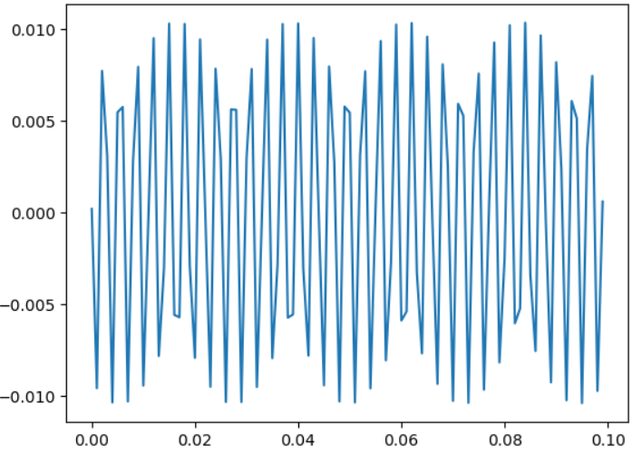
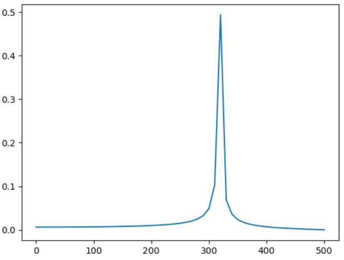
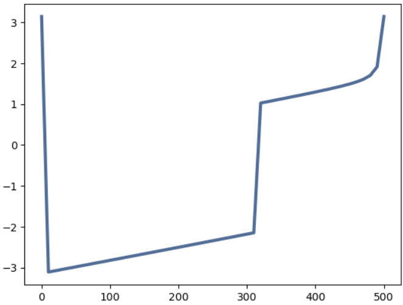

# 📡 Simulación del Circuito RLC Serie (Examen U3)

# ASYSC_C3
Análisis de sistemas: Cierre corte 3
## Gráficas Generadas

se muestran los resultados obtenidos del caso 1
### Señal en el tiempo


### Espectro de la señal


### Fase de la señal


## Estructura del repositorio
```
ASYSC_C3/  
├── ASYSC_ExamenC3_V3.ipynb  
├── README.md  
└── imagenes/  
    ├── onda.png  
    ├── espectro.png  
    └── fase.png  
```
## Autores

| Nombre                       | No. Control | 
|-----------------------------|-------------|
| Esteban Pérez Sánchez       | TI23110362  | 
| Christopher Jimenez Hurtado | CTI2211803  | 

